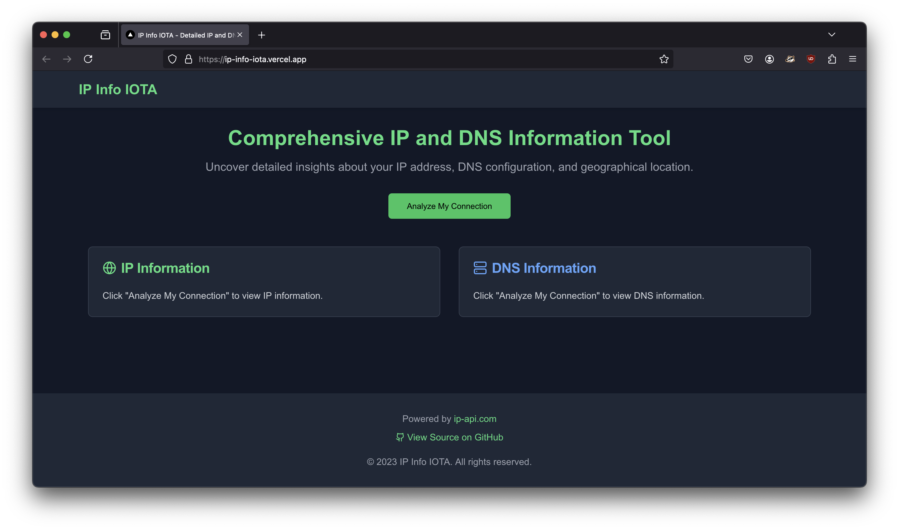

# IP Info IOTA

## About

IP Info IOTA is a web app that shows you details about your internet connection. It tells you about your IP address and DNS settings in an easy-to-understand way.

## Main Features

1. **IP Information**: See where your connection is coming from and who provides it.
2. **DNS Details**: Learn about the servers that help you browse the web.
3. **Map View**: See your IP location on a world map.
4. **Fast Loading**: We save information to show it to you quickly.
5. **Accurate Detection**: We find your real IP address, not our server's.

## How to Use

1. Go to our website. (https://ip-info-iota.vercel.app)
2. That's it! We'll show you your connection info right away.

## Why Use It?

- Check if your VPN is working.
- See if your location is correct.
- Learn about your internet provider.
- Understand how you connect to the internet.

## Tech We Use

- Next.js 13
- React Leaflet for maps
- Tailwind CSS for design
- Vercel KV for saving data
- Lucide React for icons

## Recent Updates

- Now works better with different user locations.
- Saves data for each user separately.
- Handles errors better.

## Privacy

We use random codes to look up DNS info to keep your data safe. We only use your IP to show you information about it.

## What's Next?

- Better error messages
- More network details
- Save your past lookups
- Let you check other IP addresses
- Work better on phones

We'd love to hear what you think!

## Thanks To

- ip-api.com for IP data
- OpenStreetMap for maps

## License

© 2024 IOTA. All rights reserved.
